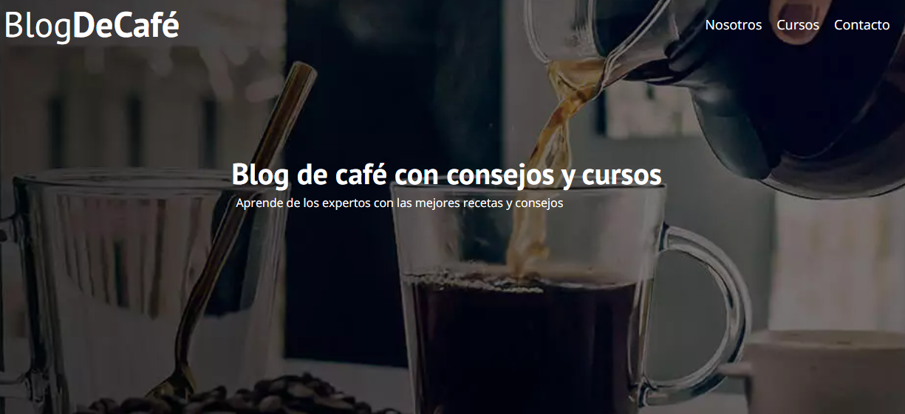

# Proyecto Blog de cafe

Este proyecto *BlogDeCafe* fue realizado con la finalidad de poner en practica conceptos básicos en la elaboración de sitios Web, usando solo de HTML y CSS.

**No es un blog real** por lo tanto la información que aqui se suministra puede que no sea precisa.

## Enlaces a blogs reales

La información de relleno que se utilizó para este proyecto se puede encontrar en los siguientes enlaces:

* [Philips](https://www.philips.cl/c-m-ho/cafe/cafe-101/la-cosecha-y-los-tipos-de-granos-de-cafe)
* [Cafemalist](https://cafemalist.com/)
* [Directoalpaladar](https://www.directoalpaladar.com/)

